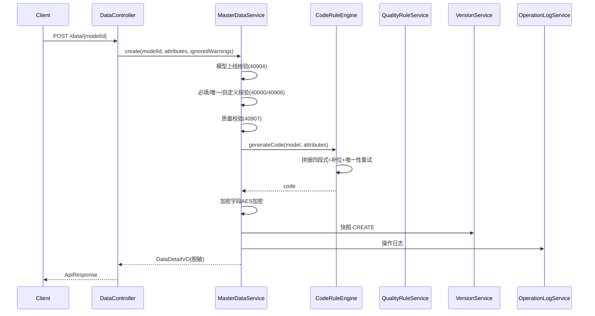

# API 文档 — 主数据管理平台（backend REST API v1）

## 文档版本

| 版本 | 日期 | 修改说明 | 作者 |
|------|------|----------|------|
| v1.0 | 2026-09-23 | 初始版本 | AI Devops |

---

## 一、通用约定

- **Base URL**：`http://{host}:8080/api/v1`
- **认证方式**：请求头 `X-User-Id` / `X-User-Name` / `X-User-Role`（v1.0 演示模式，由前端顶栏角色切换注入；无头默认 `guest`）
- **角色枚举**：`MODEL_ADMIN`（数据管理员）/ `DATA_STAFF`（数据录入员）/ `DATA_AUDITOR`（数据审核员）/ `SYS_ADMIN`（系统管理员）
- **统一响应结构**：

```json
{ "code": 0, "message": "success", "data": { } }
```

- **分页参数**：`page`（从 1 起）、`size`（默认 20）；分页响应 `data` 为：

```json
{ "total": 100, "page": 1, "size": 20, "list": [ ] }
```

- **时间格式**：ISO-8601 字符串（`2026-09-23T10:00:00`）

## 二、错误码定义

| 错误码 | 说明 | 关联需求 |
|--------|------|---------|
| 0 | 成功 | — |
| 40000 | 参数校验失败（含字段级明细） | REQ-BKD05 |
| 40101 | 未识别操作人（缺 X-User 头） | 通用安全 |
| 40300 | 角色无权限 | 通用安全 |
| 40400 | 资源不存在 | 通用 |
| 40901 | 分类下存在子分类或模型，禁止删除 | REQ-BKD01 |
| 40902 | 模型编码重复 | REQ-BKD02 |
| 40903 | 模型已上线，结构锁定 | REQ-BKD02 |
| 40904 | 模型未上线，禁止录入数据 | REQ-BKD05 |
| 40905 | 数据编码重复 | REQ-BKD04 |
| 40906 | 唯一字段值重复 | REQ-BKD05 |
| 40907 | 存在严重级质量问题，禁止提交 | REQ-BKD10 |
| 40908 | 数据处于待协同状态，禁止推送 | REQ-BKD08 |
| 40909 | 下游校验未通过且未强制确认 | REQ-BKD08 |
| 40910 | 编码规则非法（编码引用不在第一段等） | REQ-BKD04 |
| 42200 | 编码生成失败（唯一性重试超限） | REQ-BKD04 |
| 42201 | 导入文件解析失败 | REQ-BKD07 |
| 50000 | 系统内部错误 | 通用 |

---

## 三、接口清单

### 3.1 分类管理 `/categories`

| # | 方法 | 路径 | 说明 | 角色 | 关联需求 |
|---|------|------|------|------|---------|
| 1 | GET | /categories/tree | 完整分类树（含每分类模型数） | 全部 | REQ-BKD01 |
| 2 | GET | /categories/search?keyword= | 关键字过滤树 | 全部 | REQ-BKD01 |
| 3 | POST | /categories | 新增分类（parentId 空=根级） | MODEL_ADMIN, SYS_ADMIN | REQ-BKD01 |
| 4 | PUT | /categories/{id} | 修改分类 | MODEL_ADMIN, SYS_ADMIN | REQ-BKD01 |
| 5 | DELETE | /categories/{id} | 删除分类（有子分类/模型则 40901） | MODEL_ADMIN, SYS_ADMIN | REQ-BKD01 |

**POST /categories 请求：**

```json
{ "code": "CAT0101", "name": "原料", "parentId": 1, "sortNo": 1, "description": "生产用原料" }
```

### 3.2 模型管理 `/models`

| # | 方法 | 路径 | 说明 | 角色 | 关联需求 |
|---|------|------|------|------|---------|
| 6 | GET | /models?categoryId=&keyword=&status=&page=&size= | 分页列表（含数据条数） | 全部 | REQ-BKD02 |
| 7 | GET | /models/{id} | 模型详情（含字段/编码规则/扩展） | 全部 | REQ-BKD03 |
| 8 | POST | /models | 创建模型（mode=BLANK/INHERIT，inheritFromId） | MODEL_ADMIN, SYS_ADMIN | REQ-BKD02 |
| 9 | PUT | /models/{id} | 更新模型定义（上线后结构锁定） | MODEL_ADMIN, SYS_ADMIN | REQ-BKD02/03 |
| 10 | POST | /models/{id}/online | 上线 | MODEL_ADMIN, SYS_ADMIN | REQ-BKD02 |
| 11 | POST | /models/{id}/offline | 下线 | MODEL_ADMIN, SYS_ADMIN | REQ-BKD02 |
| 12 | GET | /models/{id}/versions | 版本列表 | 全部 | REQ-BKD02 |
| 13 | GET | /models/{id}/versions/{v1}/diff/{v2} | 两版本差异 | 全部 | REQ-BKD02 |
| 14 | POST | /models/{id}/versions/{versionNo}/rollback | 回滚到指定版本 | MODEL_ADMIN, SYS_ADMIN | REQ-BKD02 |

**POST /models 请求（继承创建）：**

```json
{
  "mode": "INHERIT", "inheritFromId": 3,
  "code": "MAT_PROD", "name": "成品", "categoryId": 3, "dept": "生产部"
}
```

### 3.3 主数据 `/data`

| # | 方法 | 路径 | 说明 | 角色 | 关联需求 |
|---|------|------|------|------|---------|
| 15 | GET | /data/{modelId}/view | 列表视图元数据（列定义+检索字段定义） | 全部 | REQ-BKD05 |
| 16 | GET | /data/{modelId}?page=&size=&filters= | 分页查询（filters=URL 编码 JSON） | 全部 | REQ-BKD05 |
| 17 | GET | /data/{modelId}/{id} | 详情（加密字段脱敏） | 全部 | REQ-BKD05 |
| 18 | POST | /data/{modelId}/check-duplicate | 提交前 AI 查重 | DATA_STAFF, MODEL_ADMIN, SYS_ADMIN | REQ-BKD09 |
| 19 | POST | /data/{modelId}/check-quality | 提交前质量校验 | DATA_STAFF, MODEL_ADMIN, SYS_ADMIN | REQ-BKD10 |
| 20 | POST | /data/{modelId} | 新增（自动编码 + 校验 + 快照） | DATA_STAFF, MODEL_ADMIN, SYS_ADMIN | REQ-BKD05 |
| 21 | PUT | /data/{modelId}/{id} | 修改（新版本 + 敏感变更标记协同） | DATA_STAFF, MODEL_ADMIN, SYS_ADMIN | REQ-BKD05 |
| 22 | POST | /data/{modelId}/{id}/disable | 禁用（下游预检） | DATA_STAFF, MODEL_ADMIN, SYS_ADMIN | REQ-BKD05 |
| 23 | POST | /data/{modelId}/{id}/enable | 启用 | DATA_STAFF, MODEL_ADMIN, SYS_ADMIN | REQ-BKD05 |
| 24 | DELETE | /data/{modelId}/{id}?force= | 逻辑删除（下游预检，force=true 强制） | DATA_STAFF, MODEL_ADMIN, SYS_ADMIN | REQ-BKD05 |

**POST /data/{modelId}/check-duplicate 请求/响应：**

```json
// 请求
{ "attributes": { "materialName": "不锈钢板304", "spec": "2.5*1250*2500" } }
// 响应 data
{ "maxSimilarity": 87, "items": [
  { "dataId": 101, "code": "MATCAT0101000001", "name": "不锈钢板304", "spec": "2.5*1220*2440", "similarity": 87 }
]}
```

**POST /data/{modelId} 请求：**

```json
{ "attributes": { "materialName": "不锈钢板304", "spec": "2.5*1250*2500", "unit": "吨" },
  "ignoredWarnings": [ { "ruleId": 5, "reason": "已人工复核" } ] }
```

### 3.4 版本管理 `/data/{modelId}/{id}/versions`

| # | 方法 | 路径 | 说明 | 关联需求 |
|---|------|------|------|---------|
| 25 | GET | /data/{modelId}/{id}/versions | 版本列表 | REQ-BKD06 |
| 26 | GET | /data/{modelId}/{id}/versions/{versionNo} | 版本详情（脱敏） | REQ-BKD06 |
| 27 | GET | /data/{modelId}/{id}/versions/{v1}/diff/{v2} | 两版本逐字段差异 | REQ-BKD06 |
| 28 | POST | /data/{modelId}/{id}/versions/{versionNo}/rollback | 回滚 | REQ-BKD06 |

**diff 响应 data：**

```json
{ "items": [ { "field": "spec", "label": "规格型号", "oldValue": "2.5*1220*2440", "newValue": "2.5*1250*2500" } ] }
```

### 3.5 导入导出 `/data/{modelId}`

| # | 方法 | 路径 | 说明 | 角色 | 关联需求 |
|---|------|------|------|------|---------|
| 29 | GET | /data/{modelId}/template | 下载导入模板 xlsx | DATA_STAFF, MODEL_ADMIN, SYS_ADMIN | REQ-BKD07 |
| 30 | GET | /data/{modelId}/export?filters= | 按筛选导出 xlsx | DATA_STAFF, MODEL_ADMIN, SYS_ADMIN | REQ-BKD07 |
| 31 | POST | /data/{modelId}/import | 上传导入（multipart file） | DATA_STAFF, MODEL_ADMIN, SYS_ADMIN | REQ-BKD07 |
| 32 | POST | /data/{modelId}/import/errors | 导出错误明细 xlsx（回传失败行 JSON） | DATA_STAFF, MODEL_ADMIN, SYS_ADMIN | REQ-BKD07 |

**POST /import 响应 data：**

```json
{ "total": 20, "success": 18, "failed": 2,
  "errorRows": [ { "rowNo": 3, "attributes": { }, "errors": [ "物料名称：必填" ] } ] }
```

### 3.6 推送与协同 `/push`

| # | 方法 | 路径 | 说明 | 角色 | 关联需求 |
|---|------|------|------|------|---------|
| 33 | GET | /push/systems | 下游系统列表 | 全部 | REQ-BKD08 |
| 34 | POST | /push/precheck | 推送前下游预检 | DATA_STAFF, DATA_AUDITOR, SYS_ADMIN | REQ-BKD08 |
| 35 | POST | /push/execute | 执行推送（待协同数据 40908） | DATA_STAFF, DATA_AUDITOR, SYS_ADMIN | REQ-BKD08 |
| 36 | GET | /push/logs?dataId=&systemId=&page=&size= | 推送日志分页 | 全部 | REQ-BKD08 |
| 37 | GET | /collaborations?status=&page=&size= | 协同工单列表 | 全部 | REQ-BKD08 |
| 38 | POST | /collaborations/{id}/confirm | 协同确认（comment 可选） | DATA_AUDITOR, SYS_ADMIN | REQ-BKD08 |
| 39 | POST | /collaborations/{id}/reject | 协同驳回 | DATA_AUDITOR, SYS_ADMIN | REQ-BKD08 |

**POST /push/precheck 请求/响应：**

```json
// 请求
{ "dataIds": [101, 102], "systemIds": [1, 2] }
// 响应 data
{ "results": [ { "dataId": 101, "systemId": 1, "systemCode": "ERP", "status": "PASS", "message": "允许操作" } ] }
```

### 3.7 质量规则 `/quality`

| # | 方法 | 路径 | 说明 | 角色 | 关联需求 |
|---|------|------|------|------|---------|
| 40 | GET | /quality/rules?modelId= | 规则列表（modelId 空=全局） | 全部 | REQ-BKD10 |
| 41 | POST | /quality/rules | 新增规则 | MODEL_ADMIN, SYS_ADMIN | REQ-BKD10 |
| 42 | PUT | /quality/rules/{id} | 修改规则 | MODEL_ADMIN, SYS_ADMIN | REQ-BKD10 |
| 43 | DELETE | /quality/rules/{id} | 删除规则 | MODEL_ADMIN, SYS_ADMIN | REQ-BKD10 |

### 3.8 操作日志与统计 `/logs`、`/stats`

| # | 方法 | 路径 | 说明 | 角色 | 关联需求 |
|---|------|------|------|------|---------|
| 44 | GET | /logs?bizType=&operation=&startTime=&endTime=&page=&size= | 操作日志分页 | 全部 | REQ-BKD10 |
| 45 | GET | /stats/overview | 首页统计（模型数/数据量/今日操作/推送成功率） | 全部 | REQ-FED07 |

---

## 四、核心接口详设示例

### 4.1 GET /data/{modelId}/view — 动态列表视图

**响应 data：**

```json
{
  "model": { "id": 3, "code": "MAT_RAW", "name": "原材料", "status": "ONLINE", "treeEnabled": false },
  "columns": [ { "name": "code", "label": "编码", "type": "TEXT", "width": 220 },
               { "name": "materialName", "label": "物料名称", "type": "TEXT", "width": 180 } ],
  "searchFields": [ { "name": "materialName", "label": "物料名称", "type": "TEXT" },
                    { "name": "unit", "label": "计量单位", "type": "SELECT", "domainValues": ["吨","千克","米"] } ],
  "fieldGroups": [ { "name": "基本信息", "fields": [ ] } ]
}
```

### 4.2 POST /models/{id}/online — 上线

**前置校验：** 模型存在且未删除 → 至少 1 个字段 → 编码规则合法（若有 MODEL_REF 段必须在第一段）。

**后置动作：** 状态置 ONLINE、生成版本快照（operation=ONLINE）、写操作日志。

**错误：** 40400（不存在）、40910（编码规则非法）。

### 4.3 POST /data/{modelId} — 新增主数据（核心流程）

**时序：**


