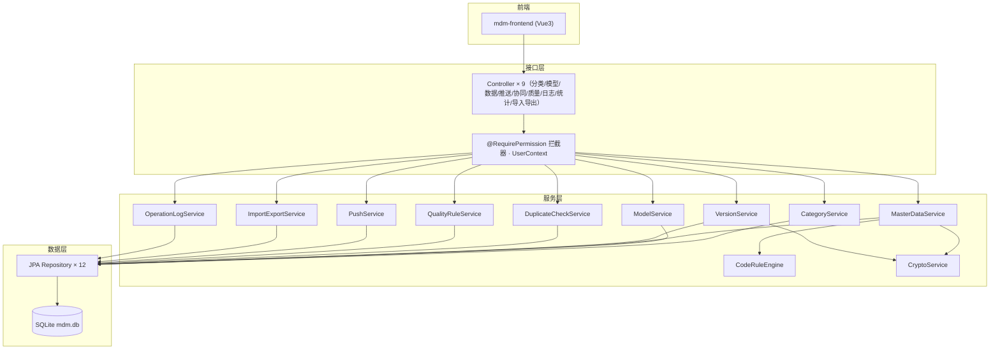
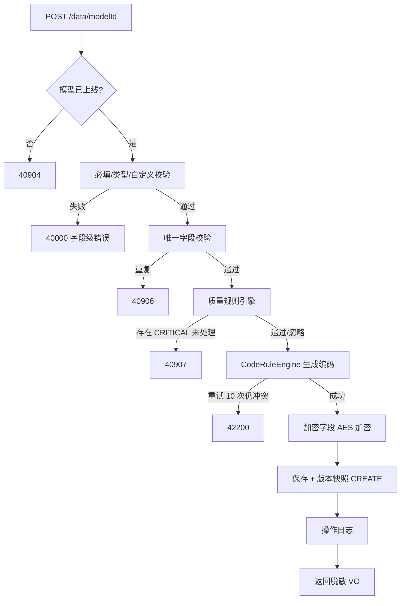
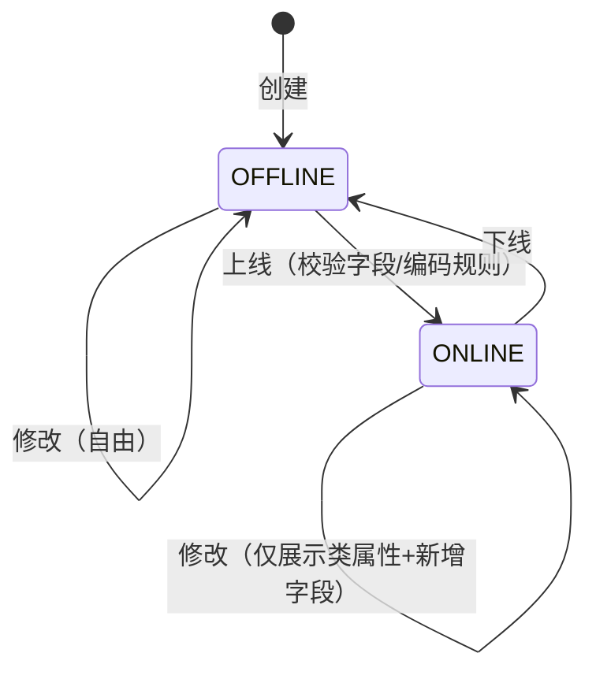
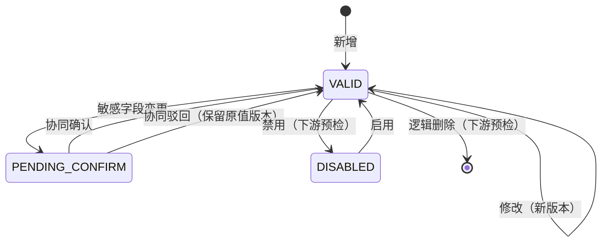
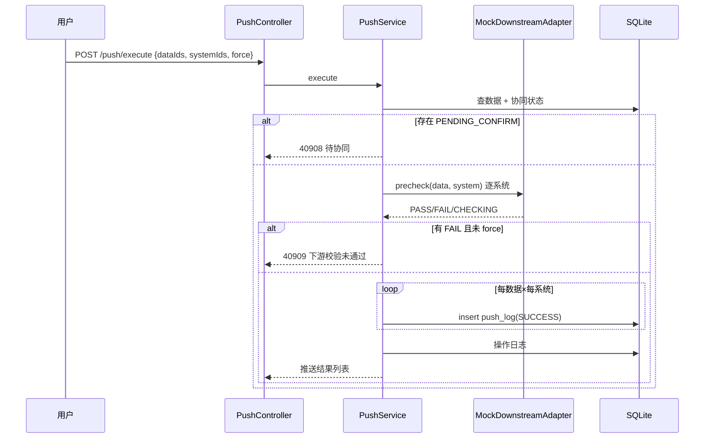

# 主数据管理平台（backend）— 详细设计文档

## 文档信息

| 项目 | 内容 |
|------|------|
| 所属服务 | mdm-backend |
| 需求文档 | 01-requirements/MDM-0001/requirements.md（REQ-BKD01 ~ REQ-BKD10） |
| 设计日期 | 2026-09-23 |
| 版本 | v1.0 |

---

## 一、设计决策表

| 决策项 | 决策 | 理由 |
|--------|------|------|
| ORM | Spring Data JPA + Hibernate Community SQLite Dialect | 元数据驱动场景下动态 JSON 查询为主，JPA 实体少而稳；MyBatis 无增益 |
| 动态数据存储 | mdm_master_data 单表 + attributes JSON | 见 SQL 设计决策；查询经元数据驱动的内存过滤 + 分页 |
| 编码引擎 | 独立组件 CodeRuleEngine + mdm_code_sequence 原子计数 | 并发安全；可单测 |
| 查重算法 | Levenshtein 归一化 0.6 + Jaccard 分词 0.4 加权 | 纯本地、无外部依赖；适配器接口可替换 AI 服务 |
| 下游校验 | DownstreamAdapter 接口 + Mock 实现（确定性随机：95% PASS/4% FAIL/1% CHECKING） | v1.0 演示闭环；v2.0 换 HTTP 实现 |
| 加密 | AES/ECB/PKCS5Padding 单密钥（`app.security.aes-key`） | Q&A Q2 决议；v2.0 升级密钥管理 |
| 时间 | `TEXT` ISO-8601，工具类 `Times.now()` | SQLite 无原生 datetime |
| 认证 | X-User-* 头 + `@RequirePermission` 拦截器 | v1.0 演示模式，接口语义与正式网关一致 |

---

## 二、系统架构

### 2.1 分层架构



### 2.2 模块划分

| 模块 | 职责 | 对应需求 |
|------|------|---------|
| category | 分类树 CRUD/删除保护/搜索 | REQ-BKD01 |
| model | 模型生命周期/版本/继承 | REQ-BKD02/03 |
| coderule | 编码四段式生成 | REQ-BKD04 |
| data | 主数据动态 CRUD/校验/加密 | REQ-BKD05 |
| version | 数据版本快照/diff/回滚 | REQ-BKD06 |
| io | Excel 模板/导入/导出/错误明细 | REQ-BKD07 |
| push | 下游预检/推送/协同状态机 | REQ-BKD08 |
| duplicate | 相似度查重 | REQ-BKD09 |
| quality | 质量规则引擎 | REQ-BKD10 |
| audit | 操作日志 | REQ-BKD10 |

### 2.3 目录结构

```
mdm-backend/
├── pom.xml
├── data/                                # SQLite 数据库文件（运行时生成）
└── src/main/java/com/mdm/platform/
    ├── MdmApplication.java
    ├── common/
    │   ├── ApiResponse.java / PageResult.java
    │   ├── ErrorCode.java / BusinessException.java
    │   └── GlobalExceptionHandler.java
    ├── security/
    │   ├── RequirePermission.java / Role.java / UserContext.java
    │   └── PermissionInterceptor.java
    ├── category/
    │   ├── CategoryController.java / CategoryService.java
    │   ├── CategoryRepository.java / CategoryEntity.java
    │   └── CategoryTreeVO.java
    ├── model/
    │   ├── ModelController.java / ModelService.java
    │   ├── ModelRepository.java / ModelEntity.java / ModelVersionEntity.java / ModelVersionRepository.java
    │   └── dto/（ModelCreateRequest、ModelUpdateRequest、FieldDef、CodeRuleSegment、ExtConfig、ModelVO…）
    ├── data/
    │   ├── MasterDataController.java / MasterDataService.java
    │   ├── MasterDataRepository.java / MasterDataEntity.java
    │   ├── DataVersionEntity.java / DataVersionRepository.java
    │   ├── VersionService.java
    │   └── dto/（DataViewVO、DataQueryRequest、DataUpsertRequest、DataDetailVO、DataVersionVO、DataDiffVO…）
    ├── coderule/
    │   ├── CodeRuleEngine.java / CodeSequenceRepository.java / CodeSequenceEntity.java
    │   └── CodeRuleValidator.java
    ├── duplicate/
    │   ├── DuplicateCheckService.java / DuplicateCheckAdapter.java / LocalSimilarityAdapter.java
    │   └── dto/（DuplicateCheckRequest、SimilarItemVO…）
    ├── quality/
    │   ├── QualityRuleController.java / QualityRuleService.java
    │   ├── QualityRuleEntity.java / QualityRuleRepository.java / QualityResultEntity.java / QualityResultRepository.java
    │   └── dto/（QualityCheckResult、QualityViolation…）
    ├── io/（ImportExportController.java / ImportExportService.java / ImportResultVO）
    ├── push/
    │   ├── PushController.java / CollaborationController.java / PushService.java
    │   ├── DownstreamSystemEntity.java / PushLogEntity.java / CollaborationEntity.java + Repository
    │   └── DownstreamAdapter.java / MockDownstreamAdapter.java / dto/（PrecheckResultVO…）
    └── audit/
        ├── OperationLogController.java / OperationLogService.java
        ├── OperationLogEntity.java / OperationLogRepository.java
        └── StatsController.java
src/main/resources/
    ├── application.yml
    ├── schema.sql / data.sql
src/test/java/com/mdm/platform/
    ├── coderule/CodeRuleEngineTest.java
    ├── duplicate/LocalSimilarityAdapterTest.java
    ├── quality/QualityRuleServiceTest.java
    └── category/CategoryServiceTest.java（纯 JUnit + mock Repository）
```

---

## 三、业务逻辑设计

### 3.1 核心流程：新增主数据



### 3.2 状态机

**模型状态：**



| 当前状态 | 事件 | 目标状态 | 前置校验 | 后置动作 |
|---------|------|---------|---------|---------|
| OFFLINE | online | ONLINE | ≥1 字段；编码规则合法 | 版本快照(ONLINE)、日志 |
| ONLINE | offline | OFFLINE | 无 | 版本快照(OFFLINE)、日志 |

**数据状态：**



| 当前状态 | 事件 | 目标状态 | 前置校验 | 后置动作 |
|---------|------|---------|---------|---------|
| VALID | update | VALID | 全量校验 | 快照 UPDATE；若涉敏感字段→collab_status=PENDING_CONFIRM + 协同工单 |
| PENDING_CONFIRM | confirm | VALID（CONFIRMED） | 审核员角色 | 数据可推送 |
| PENDING_CONFIRM | reject | VALID（REJECTED） | 审核员角色 | 工单记录驳回意见 |
| VALID | disable | DISABLED | 下游预检全过或 force | 快照 DISABLE、日志 |
| DISABLED | enable | VALID | 无 | 快照 ENABLE、日志 |
| VALID/DISABLED | delete | （del_flag=1） | 下游预检全过或 force | 快照 DELETE、日志 |

### 3.3 编码规则引擎（CodeRuleEngine）

**段类型求值：**

| 类型 | 求值 | 示例 |
|------|------|------|
| FIXED | 直接取 value | `MAT` |
| FIELD_REF | 取本条 attributes[fieldName]，非字符串先 toString | 分类编码 `CAT0101` |
| SEQ | `nextVal = UPDATE code_sequence SET current_value=current_value+step WHERE model_id=?`；按 length/padChar/padSide 补位 | `000001` |
| MODEL_REF | 取 attributes[fieldName] 存储的被引用数据编码（前端引用字段存对方 code） | `SUP000123` |

**规则约束（CodeRuleValidator）：** MODEL_REF 仅第一段；SEQ 每模型最多一段；length>0；padSide ∈ LEFT/RIGHT。

**唯一性重试：** 生成后查 `uk_data_code` 冲突则 SEQ 段再取号，至多 10 次 → 42200。

### 3.4 相似度算法（LocalSimilarityAdapter）

```
normLev(a,b) = 1 - lev(a,b)/max(len(a),len(b))       // 编辑距离归一化
jaccard(a,b) = |tokens(a) ∩ tokens(b)| / |tokens(a) ∪ tokens(b)|  // 2-gram 分词
similarity(a,b) = 0.6*normLev + 0.4*jaccard
```

参与字段：模型中"名称/规格/型号"类文本字段（名称匹配 label 含 名称 或 name；其余 label 含 规格/型号/spec/model 的 TEXT 字段），逐字段加权平均（权重均 1）。整体相似度 = max(记录相似度)。返回 Top 5（similarity ≥ 60 才入选），最高 ≥ 80 标记高度相似。

### 3.5 质量规则引擎（QualityRuleService）

规则表达（expression JSON，按 rule_type 解释）：

| 类型 | expression 结构 | 求值 |
|------|----------------|------|
| COMPLIANCE（合规） | `{ "op": "LENGTH_MAX" / "REGEX" / "NUM_RANGE", "value": 50 或 "^1[3-9]\\d{9}$" 或 [0,10000] }` | 长度/正则/数值范围 |
| CONSISTENCY（一致） | `{ "refField": "unit", "inDomain": true }` 或 `{ "fieldA": "price", "op": "LTE", "fieldB": "taxPrice" }` | 值域归属 / 字段间比较 |
| COMPLETENESS（完整） | `{ }`（目标字段由 field_name 指明） | 非空检查 |

求值输出 `QualityCheckResult{ violations: [{ruleId, severity, message, fieldName}] }`；调用方将 CRITICAL 且未被 ignoredWarnings 覆盖的项判定 40907。

### 3.6 时序图：推送（含协同）



---

## 四、接口/方法设计

> 完整契约见 `api/api-mdm-0001.md`（45 个接口）。服务层关键方法签名：

| 类 | 方法 | 说明 |
|----|------|------|
| CodeRuleEngine | `String generate(ModelEntity model, Map<String,Object> attributes)` | 生成编码（含重试） |
| CodeRuleValidator | `void validate(List<CodeRuleSegment> rules)` | 规则合法性（40910） |
| MasterDataService | `DataDetailVO create(Long modelId, DataUpsertRequest req, UserContext user)` | 新增（3.1 流程） |
| MasterDataService | `DataDetailVO update(Long modelId, Long id, DataUpsertRequest req, UserContext user)` | 修改（新版本+协同判定） |
| MasterDataService | `void changeStatus(... Disable/Enable/Delete + force)` | 状态流转（3.2 表） |
| VersionService | `DataVersionVO snapshot(...)` / `List<DataDiffVO> diff(v1, v2)` / `rollback(...)` | 快照/diff/回滚 |
| DuplicateCheckService | `DuplicateCheckVO check(Long modelId, Map<String,Object> attributes)` | 查重 |
| QualityRuleService | `QualityCheckResult evaluate(Long modelId, Map<String,Object> attributes)` | 质量求值 |
| ImportExportService | `byte[] template(modelId)` / `byte[] export(modelId, filters)` / `ImportResultVO importExcel(modelId, MultipartFile)` | IO |
| PushService | `PrecheckVO precheck(...)` / `PushResultVO execute(...)` / `confirm/reject` | 推送与协同 |

---

## 五、错误处理设计

- **业务异常**：`BusinessException(ErrorCode, message)` → `GlobalExceptionHandler` → `ApiResponse{code, message}`；40000 附 `data` 字段级错误列表（field→message）。
- **参数校验异常**：`MethodArgumentNotValidException` → 40000。
- **系统异常**：`Exception` → 50000（日志 error，不泄漏堆栈给客户端）。

---

## 六、设计追溯矩阵

| 设计产物 | 对应需求 |
|---------|---------|
| mdm_category 表 + CategoryService | REQ-BKD01 |
| mdm_model / mdm_model_version + ModelService | REQ-BKD02/03 |
| CodeRuleEngine + mdm_code_sequence | REQ-BKD04 |
| mdm_master_data + MasterDataService + CryptoService | REQ-BKD05 |
| mdm_data_version + VersionService | REQ-BKD06 |
| ImportExportService（POI） | REQ-BKD07 |
| mdm_downstream_system / push_log / collaboration + PushService | REQ-BKD08 |
| DuplicateCheckAdapter + LocalSimilarityAdapter | REQ-BKD09 |
| mdm_quality_rule / result + QualityRuleService | REQ-BKD10 |
| mdm_operation_log + OperationLogService + PermissionInterceptor | REQ-BKD10 / 通用安全 |

---

## 七、测试策略

### 7.1 单元测试（纯 JUnit，无 Spring 上下文）

| 测试对象 | 测试重点 |
|----------|----------|
| CodeRuleEngineTest | 四段式拼接、补位方向、MODEL_REF 仅第一段校验、唯一性重试、冲突超限 |
| LocalSimilarityAdapterTest | 完全相同=100、完全不同=0、编辑距离归一化、分词 Jaccard、阈值过滤 |
| QualityRuleServiceTest | 三类规则求值、三级告警、忽略逻辑 |
| CategoryServiceTest | 删除保护（子分类/关联模型）、树构建、搜索 |

### 7.2 集成测试（人工/脚本）

| 场景 | 验证点 |
|------|--------|
| 启动 → schema/data.sql 初始化 | 演示模型与种子数据就绪 |
| 新增原材料 → 编码 `MATCAT010100000x` | 编码规则端到端 |
| 修改敏感字段 → 待协同 → 确认 → 推送 | 协同状态机闭环 |
| 导入含错误行 Excel → 错误明细下载 | 导入闭环 |
