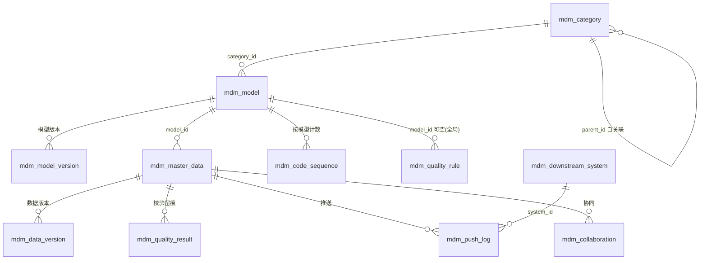

# SQL / 数据结构设计 — 主数据管理平台（backend）

## 文档版本

| 版本 | 日期 | 修改说明 | 作者 |
|------|------|----------|------|
| v1.0 | 2026-09-23 | 初始版本 | AI Devops |

---

> **说明**：数据库为 SQLite 3（文件库 `data/mdm.db`），JPA + Hibernate Community Dialect。
> DDL 由 Spring Boot `schema.sql` 在首次启动时执行（`spring.sql.init.mode=always` + `CREATE TABLE IF NOT EXISTS`）。
> 动态结构（字段定义、编码规则、版本快照等）以 JSON 文本列存储，业务侧由 Jackson 序列化。

## 一、数据结构清单

| 结构名 | 类型 | 关联需求 | 说明 | 预估数据量 |
|--------|------|---------|------|-----------|
| mdm_category | 表 | REQ-BKD01 | 分类树（自关联无限层级） | < 1k |
| mdm_model | 表 | REQ-BKD02/03 | 数据模型主表（含 JSON 元数据） | < 1k |
| mdm_model_version | 表 | REQ-BKD02 | 模型版本快照 | < 10k |
| mdm_master_data | 表 | REQ-BKD05 | 主数据主表（动态属性 JSON） | < 1M |
| mdm_data_version | 表 | REQ-BKD06 | 主数据版本快照 | < 5M |
| mdm_code_sequence | 表 | REQ-BKD04 | 编码顺序值（按模型计数） | < 1k |
| mdm_quality_rule | 表 | REQ-BKD10 | 质量规则配置 | < 1k |
| mdm_quality_result | 表 | REQ-BKD10 | 质量校验结果留痕 | < 1M |
| mdm_downstream_system | 表 | REQ-BKD08 | 下游系统注册表 | < 100 |
| mdm_push_log | 表 | REQ-BKD08 | 推送日志 | < 1M |
| mdm_collaboration | 表 | REQ-BKD08 | 协同确认工单 | < 100k |
| mdm_operation_log | 表 | REQ-BKD10 | 操作审计日志 | < 5M |

---

## 二、详细设计

### 2.1 mdm_category — 分类树

**关联需求：** REQ-BKD01

```sql
CREATE TABLE IF NOT EXISTS mdm_category (
    id              INTEGER PRIMARY KEY AUTOINCREMENT,
    code            TEXT    NOT NULL,
    name            TEXT    NOT NULL,
    parent_id       INTEGER,
    sort_no         INTEGER DEFAULT 0,
    description     TEXT,
    -- 审计字段 --
    created_by      TEXT,
    created_time    TEXT,
    updated_by      TEXT,
    updated_time    TEXT,
    del_flag        INTEGER DEFAULT 0
);
CREATE UNIQUE INDEX IF NOT EXISTS uk_category_code ON mdm_category(code) WHERE del_flag = 0;
CREATE INDEX IF NOT EXISTS idx_category_parent ON mdm_category(parent_id);
```

### 2.2 mdm_model — 数据模型主表

**关联需求：** REQ-BKD02、REQ-BKD03

```sql
CREATE TABLE IF NOT EXISTS mdm_model (
    id              INTEGER PRIMARY KEY AUTOINCREMENT,
    code            TEXT    NOT NULL,          -- 标准编码，全局唯一
    name            TEXT    NOT NULL,          -- 标准名称
    category_id     INTEGER NOT NULL,          -- 所属分类
    dept            TEXT,                      -- 归口部门
    status          TEXT    DEFAULT 'OFFLINE', -- ONLINE / OFFLINE
    version_no      INTEGER DEFAULT 1,         -- 当前版本号
    field_defs      TEXT    NOT NULL,          -- 字段定义列表 JSON
    code_rules      TEXT,                      -- 编码规则段列表 JSON
    ext_config      TEXT,                      -- 扩展配置 JSON（流程标题/树形结构）
    description     TEXT,
    -- 审计字段 --
    created_by      TEXT,
    created_time    TEXT,
    updated_by      TEXT,
    updated_time    TEXT,
    del_flag        INTEGER DEFAULT 0
);
CREATE UNIQUE INDEX IF NOT EXISTS uk_model_code ON mdm_model(code) WHERE del_flag = 0;
CREATE INDEX IF NOT EXISTS idx_model_category ON mdm_model(category_id);
```

**field_defs JSON 结构**（FieldDef 列表）：

```json
[{
  "name": "materialName", "label": "物料名称", "type": "TEXT",
  "required": true, "unique": true, "listShow": true, "selectable": false,
  "domainSource": "MANUAL", "domainValues": [], "refModelCode": null,
  "refFilter": null, "multiSelect": false, "searchable": true, "popup": false,
  "encrypted": false, "securityLevel": "PUBLIC", "securityRule": null,
  "defaultValue": null, "group": "基本信息", "customRule": null
}]
```

**code_rules JSON 结构**（CodeRuleSegment 列表）：

```json
[{
  "type": "FIXED",      "value": "MAT",   "length": null, "padChar": null, "padSide": null,
  "seqStart": null,     "seqStep": null,  "refModelCode": null, "refField": null
},
{ "type": "SEQ", "value": null, "length": 6, "padChar": "0", "padSide": "LEFT", "seqStart": 1, "seqStep": 1 }]
```

### 2.3 mdm_model_version — 模型版本快照

**关联需求：** REQ-BKD02

```sql
CREATE TABLE IF NOT EXISTS mdm_model_version (
    id              INTEGER PRIMARY KEY AUTOINCREMENT,
    model_id        INTEGER NOT NULL,
    version_no      INTEGER NOT NULL,
    status          TEXT,                 -- ONLINE / OFFLINE
    snapshot        TEXT    NOT NULL,     -- 模型完整定义 JSON
    operation       TEXT,                 -- CREATE / UPDATE / ONLINE / OFFLINE / ROLLBACK
    operator        TEXT,
    operated_time   TEXT,
    del_flag        INTEGER DEFAULT 0
);
CREATE INDEX IF NOT EXISTS idx_mver_model ON mdm_model_version(model_id, version_no);
```

### 2.4 mdm_master_data — 主数据主表

**关联需求：** REQ-BKD05

```sql
CREATE TABLE IF NOT EXISTS mdm_master_data (
    id              INTEGER PRIMARY KEY AUTOINCREMENT,
    model_id        INTEGER NOT NULL,
    code            TEXT    NOT NULL,          -- 自动生成编码，模型内唯一
    name            TEXT    NOT NULL,          -- 冗余存储名称字段值，供查重/展示
    attributes      TEXT    NOT NULL,          -- 动态属性 JSON（字段名→值；加密字段为密文）
    status          TEXT    DEFAULT 'VALID',   -- VALID / DISABLED / DRAFT
    collab_status   TEXT,                      -- PENDING_CONFIRM / CONFIRMED / REJECTED（空=无需协同）
    version_no      INTEGER DEFAULT 1,
    -- 审计字段 --
    created_by      TEXT,
    created_time    TEXT,
    updated_by      TEXT,
    updated_time    TEXT,
    del_flag        INTEGER DEFAULT 0
);
CREATE UNIQUE INDEX IF NOT EXISTS uk_data_code ON mdm_master_data(model_id, code) WHERE del_flag = 0;
CREATE INDEX IF NOT EXISTS idx_data_model ON mdm_master_data(model_id, status);
```

### 2.5 mdm_data_version — 主数据版本快照

**关联需求：** REQ-BKD06

```sql
CREATE TABLE IF NOT EXISTS mdm_data_version (
    id              INTEGER PRIMARY KEY AUTOINCREMENT,
    data_id         INTEGER NOT NULL,
    model_id        INTEGER NOT NULL,
    version_no      INTEGER NOT NULL,
    code            TEXT,
    snapshot        TEXT    NOT NULL,     -- 属性完整 JSON（含加密密文）
    operation       TEXT,                 -- CREATE / UPDATE / DISABLE / ENABLE / ROLLBACK / DELETE
    operator        TEXT,
    operated_time   TEXT,
    remark          TEXT,
    del_flag        INTEGER DEFAULT 0
);
CREATE INDEX IF NOT EXISTS idx_dver_data ON mdm_data_version(data_id, version_no);
```

### 2.6 mdm_code_sequence — 编码顺序值

**关联需求：** REQ-BKD04

```sql
CREATE TABLE IF NOT EXISTS mdm_code_sequence (
    id              INTEGER PRIMARY KEY AUTOINCREMENT,
    model_id        INTEGER NOT NULL,
    current_value   INTEGER NOT NULL DEFAULT 0,
    updated_time    TEXT,
    UNIQUE(model_id)
);
```

### 2.7 mdm_quality_rule — 质量规则

**关联需求：** REQ-BKD10

```sql
CREATE TABLE IF NOT EXISTS mdm_quality_rule (
    id              INTEGER PRIMARY KEY AUTOINCREMENT,
    model_id        INTEGER,                -- NULL=全局规则
    rule_type       TEXT    NOT NULL,       -- COMPLIANCE / CONSISTENCY / COMPLETENESS
    field_name      TEXT,                   -- 目标字段（可为空=行级）
    expression      TEXT    NOT NULL,       -- 规则表达式/参数 JSON
    severity        TEXT    NOT NULL,       -- CRITICAL / WARNING / INFO
    message         TEXT    NOT NULL,       -- 命中提示文案
    enabled         INTEGER DEFAULT 1,
    -- 审计字段 --
    created_by      TEXT,
    created_time    TEXT,
    updated_by      TEXT,
    updated_time    TEXT,
    del_flag        INTEGER DEFAULT 0
);
CREATE INDEX IF NOT EXISTS idx_qrule_model ON mdm_quality_rule(model_id, enabled);
```

### 2.8 mdm_quality_result — 质量校验结果留痕

**关联需求：** REQ-BKD10

```sql
CREATE TABLE IF NOT EXISTS mdm_quality_result (
    id              INTEGER PRIMARY KEY AUTOINCREMENT,
    data_id         INTEGER,
    model_id        INTEGER NOT NULL,
    rule_id         INTEGER,
    severity        TEXT    NOT NULL,
    message         TEXT,
    ignored         INTEGER DEFAULT 0,      -- 是否被用户忽略（告警/提示级）
    ignore_reason   TEXT,
    checked_time    TEXT,
    del_flag        INTEGER DEFAULT 0
);
CREATE INDEX IF NOT EXISTS idx_qres_data ON mdm_quality_result(data_id);
```

### 2.9 mdm_downstream_system — 下游系统注册表

**关联需求：** REQ-BKD08

```sql
CREATE TABLE IF NOT EXISTS mdm_downstream_system (
    id              INTEGER PRIMARY KEY AUTOINCREMENT,
    code            TEXT    NOT NULL,       -- ERP / MES / WMS ...
    name            TEXT    NOT NULL,
    sys_type        TEXT,
    endpoint        TEXT,                   -- v2.0 真实对接地址
    enabled         INTEGER DEFAULT 1,
    -- 审计字段 --
    created_by      TEXT,
    created_time    TEXT,
    updated_by      TEXT,
    updated_time    TEXT,
    del_flag        INTEGER DEFAULT 0
);
CREATE UNIQUE INDEX IF NOT EXISTS uk_sys_code ON mdm_downstream_system(code) WHERE del_flag = 0;
```

### 2.10 mdm_push_log — 推送日志

**关联需求：** REQ-BKD08

```sql
CREATE TABLE IF NOT EXISTS mdm_push_log (
    id              INTEGER PRIMARY KEY AUTOINCREMENT,
    data_id         INTEGER NOT NULL,
    data_code       TEXT,
    model_id        INTEGER NOT NULL,
    system_id       INTEGER NOT NULL,
    system_code     TEXT,
    result          TEXT    NOT NULL,       -- SUCCESS / FAILED / SKIPPED
    detail          TEXT,
    operator        TEXT,
    pushed_time     TEXT,
    del_flag        INTEGER DEFAULT 0
);
CREATE INDEX IF NOT EXISTS idx_push_data ON mdm_push_log(data_id);
CREATE INDEX IF NOT EXISTS idx_push_time ON mdm_push_log(pushed_time);
```

### 2.11 mdm_collaboration — 协同确认工单

**关联需求：** REQ-BKD08

```sql
CREATE TABLE IF NOT EXISTS mdm_collaboration (
    id              INTEGER PRIMARY KEY AUTOINCREMENT,
    data_id         INTEGER NOT NULL,
    model_id        INTEGER NOT NULL,
    reason          TEXT,                   -- 触发原因（敏感字段变更说明）
    collaborator    TEXT,                   -- 协同人（数据审核员）
    status          TEXT    DEFAULT 'PENDING', -- PENDING / CONFIRMED / REJECTED
    applicant       TEXT,                   -- 发起人
    apply_time      TEXT,
    confirm_time    TEXT,
    confirm_comment TEXT,
    del_flag        INTEGER DEFAULT 0
);
CREATE INDEX IF NOT EXISTS idx_collab_data ON mdm_collaboration(data_id);
```

### 2.12 mdm_operation_log — 操作审计日志

**关联需求：** REQ-BKD10

```sql
CREATE TABLE IF NOT EXISTS mdm_operation_log (
    id              INTEGER PRIMARY KEY AUTOINCREMENT,
    biz_type        TEXT    NOT NULL,       -- CATEGORY / MODEL / DATA / PUSH / COLLAB / IMPORT / EXPORT
    operation       TEXT    NOT NULL,       -- CREATE / UPDATE / DELETE / ONLINE / DISABLE / PUSH / ...
    target_id       TEXT,
    target_desc    TEXT,
    detail          TEXT,                   -- 详情 JSON
    operator        TEXT,
    operated_time   TEXT,
    del_flag        INTEGER DEFAULT 0
);
CREATE INDEX IF NOT EXISTS idx_oplog_time ON mdm_operation_log(operated_time, biz_type, operation);
```

---

## 三、关系图



---

## 四、设计决策

| 决策项 | 决策 | 理由 |
|--------|------|------|
| 动态字段存储 | 单表 + attributes JSON | 避免每模型建物理表；SQLite JSON 函数可按需检索；模型数量有限、查询以元数据驱动为主 |
| 唯一约束 | 部分唯一索引（WHERE del_flag=0） | 逻辑删除数据不占用唯一性 |
| 顺序值独立表 | mdm_code_sequence 按 model_id 计数 | 避免并发下的 MAX+1 竞争；UPDATE 原子递增 |
| 时间类型 | TEXT（ISO-8601） | SQLite 原生无 datetime；统一 UTC ISO 字符串便于排序与跨语言解析 |
| 版本快照全量 JSON | 不做增量 diff 存储 | 实现简单、读取 O(1)；diff 在内存计算，数据量在 5M 内性能可接受 |

---

## 五、种子数据（data.sql）

| 类别 | 内容 |
|------|------|
| 分类树 | 行业核心经营类（CAT01）→ 原料（CAT0101）/成品（CAT0102）/半成品（CAT0103）；合作伙伴类（CAT02）→ 供应商（CAT0201）/客户（CAT0202）；组织人员类（CAT03）→ 员工（CAT0301）；公共基础类（CAT04）→ 行政区划（CAT0401） |
| 演示模型 | "原材料"模型（MAT_RAW，已上线）：基本信息/技术参数/财务信息三组字段 + 编码规则 `MAT`+分类编码+6 位顺序号 |
| 下游系统 | ERP（SAP）、MES、WMS 三系统 |
| 质量规则 | 原材料模型：物料名称非空（完整性/严重）、规格型号长度≤50（合规性/告警）、计量单位在值域内（一致性/提示） |
| 演示数据 | 原材料模型 6 条（含 1 条草稿、1 条停用） |
