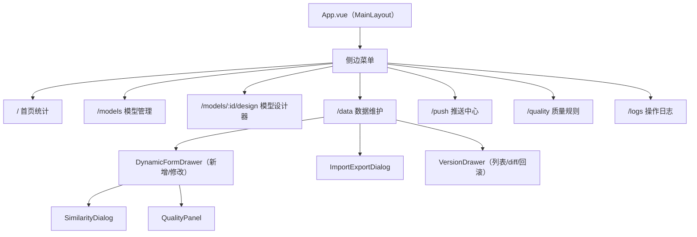

# 主数据管理平台（frontend）— 详细设计文档

## 文档信息

| 项目 | 内容 |
|------|------|
| 所属服务 | mdm-frontend |
| 需求文档 | 01-requirements/MDM-0001/requirements.md（REQ-FED01 ~ REQ-FED07） |
| 设计日期 | 2026-09-23 |
| 版本 | v1.0 |

---

## 一、设计决策表

| 决策项 | 决策 | 理由 |
|--------|------|------|
| 技术栈 | Vue 3（`<script setup>`）+ Vite 5 + Element Plus + Pinia + Vue Router 4 | project-config.yaml 既定 |
| HTTP | Axios 实例统一封装（baseURL `/api/v1`、X-User-* 注入、ApiResponse 拦截） | REQ-FED01 |
| 角色模拟 | Pinia `userStore`（localStorage 持久化）顶栏切换 | 演示模式与后端 X-User 语义一致 |
| 动态渲染 | 单一 `DynamicField` 组件按 FieldDef.type + 属性渲染控件 | 复用于表单/筛选/弹窗选择 |
| 状态 | 页面局部状态（ref/reactive）；仅 userStore + 当前模型缓存入 Pinia | 避免过度全局化 |

---

## 二、系统架构

### 2.1 页面结构



### 2.2 目录结构

```
mdm-frontend/
├── package.json / vite.config.js / index.html
└── src/
    ├── main.js / App.vue
    ├── api/（http.js + category.js + model.js + data.js + push.js + quality.js + log.js + stats.js）
    ├── stores/user.js
    ├── router/index.js
    ├── layouts/MainLayout.vue
    ├── views/
    │   ├── Dashboard.vue
    │   ├── ModelList.vue
    │   ├── ModelDesigner.vue
    │   ├── DataMaintenance.vue
    │   ├── PushCenter.vue
    │   ├── QualityRules.vue
    │   └── OperationLogs.vue
    └── components/
        ├── CategoryTreePanel.vue
        ├── DynamicField.vue
        ├── DynamicFormDrawer.vue
        ├── SimilarityDialog.vue
        ├── QualityPanel.vue
        ├── VersionDrawer.vue
        ├── DiffTable.vue
        ├── ImportExportDialog.vue
        ├── RefSelectDialog.vue
        └── ModelVersionDrawer.vue
```

---

## 三、页面详细设计

### 3.1 MainLayout（REQ-FED01）

顶栏：平台名 + 角色下拉（MODEL_ADMIN/DATA_STAFF/DATA_AUDITOR/SYS_ADMIN）+ 操作人名；左侧菜单 7 项；内容区 `<router-view>`。

### 3.2 ModelList（REQ-FED02）

左：`CategoryTreePanel`（树 + 新增同级/子级/编辑/删除 + 搜索框 + 展开/折叠全部按钮；删除失败展示 40901 提示）。右：模型表格（编码/名称/分类/状态 Tag/数据条数/操作：设计、上线/下线、继承创建、版本）；顶部"空白创建/继承创建"对话框。

### 3.3 ModelDesigner（REQ-FED03）

5 Tab：基础信息（编码禁改/名称/分类/归口部门）；字段配置（可编辑表格：18 列关键属性分组展示、新增字段、未上线可删；上线后结构列 disabled）；扩展配置（流程标题字段下拉、树形结构开关 + 上级/子级/展示字段）；编码规则（段列表卡片：类型/值/长度/补位符/方向/引用模型；预览示例编码；校验 MODEL_REF 仅第一段）；版本历史（列表 + 两版本 diff 弹窗 + 回滚）。

### 3.4 DataMaintenance（REQ-FED04/05/06/07）

左：分类→模型树（仅 ONLINE）。右：`view` 元数据驱动表格 + 动态筛选区（searchFields 渲染）+ 工具栏（新增/修改/禁用/启用/删除/导出/导入/版本/推送）。行选择驱动修改等操作。新增/修改打开 `DynamicFormDrawer`：字段分组 Collapse；`DynamicField` 渲染；引用字段（popup=true）弹 `RefSelectDialog`。提交流：查重 → `SimilarityDialog`（使用已有/继续）→ 质量 → `QualityPanel`（CRITICAL 禁提交；WARNING/INFO 填原因忽略）→ POST/PUT。

### 3.5 PushCenter（REQ-FED07）

数据选择（模型 + 多选数据）→ 目标系统多选 → 预检表格（逐行 PASS/FAIL/CHECKING Tag）→ 执行推送；下方待协同工单列表（确认/驳回 + 意见）；推送日志 Tab（筛选 + 分页）。

### 3.6 QualityRules / OperationLogs / Dashboard

质量规则：模型筛选 + 规则表格 CRUD（类型/字段/表达式/等级/启用）；操作日志：时间范围 + 类型筛选 + 详情 JSON 弹窗；首页：4 统计卡片 + 最近操作列表。

---

## 四、组件设计

| 组件 | Props | 关键行为 |
|------|-------|---------|
| DynamicField | `field: FieldDef, modelValue, disabled, refApi` | TEXT→Input；LONG_TEXT→Textarea；NUMBER→InputNumber；DATE→DatePicker；SELECT→Select（multiSelect 多选）；REF→Select 远程或 RefSelectDialog 触发 |
| SimilarityDialog | `visible, items, maxSimilarity` | 相似度 Progress 条；「使用已有物料」emit cancel、跳转已有行；「确认是新物料」emit continue |
| QualityPanel | `result: QualityCheckResult` | 红/黄/蓝分组；WARNING/INFO 忽略需输入原因；存在 CRITICAL 时 emit block |
| DiffTable | `items: DiffItem[]` | 字段/旧值/新值三列，差异行高亮 |
| VersionDrawer | `modelId, dataId` | 版本表 + 选两行 diff + 回滚确认 |
| RefSelectDialog | `refModelCode, filter` | 分页表格 + 搜索 + 单选回填 code/名称 |

---

## 五、接口调用总览

全部对接 `api-mdm-0001.md` 45 接口；关键调用链：`GET /data/{id}/view` → `GET /data/{id}?filters` → `POST check-duplicate` → `POST check-quality` → `POST /data/{id}`。

---

## 六、错误处理设计

- `http.js` 响应拦截：`code!==0` → ElMessage.error(message)；40300 额外提示"请切换角色"。
- 提交 40000：表单字段级红字标注（detail map field→message）。
- 文件下载：blob 响应直接 a[download] 触发。

---

## 七、测试策略

| 场景 | 验证点 |
|------|--------|
| 角色切换 → 菜单/操作权限 | 40300 处理 |
| 动态表单全控件渲染 | 18 属性 → 控件映射 |
| 查重→质量→提交链路 | 交互闭环 |
| 版本 diff/回滚 | 差异高亮 |
