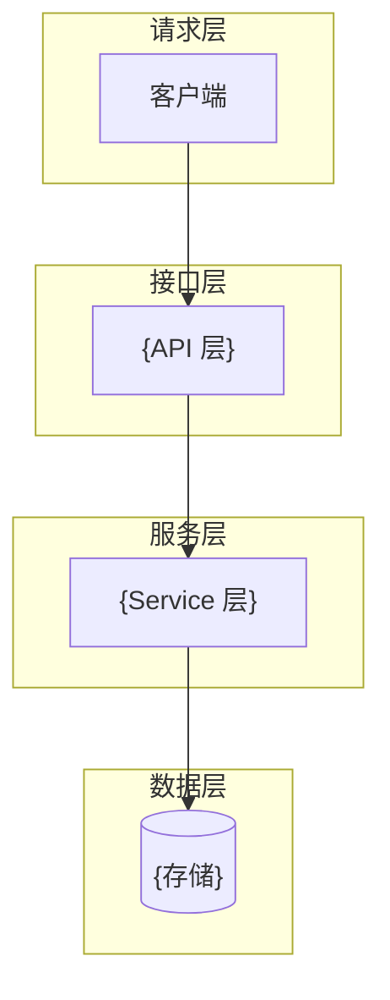
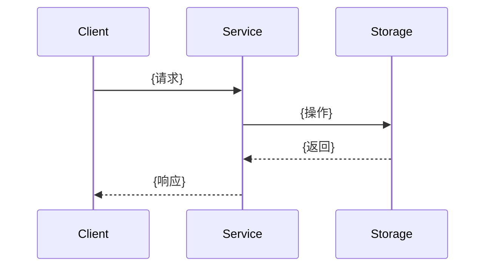

# {模块名称} — 详细设计文档

## 文档信息

| 项目 | 内容 |
|------|------|
| 所属服务 | {service-name} |
| 需求文档 | {需求文档路径}（REQ-{XX}01 ~ REQ-{XX}NN） |
| 设计日期 | {YYYY-MM-DD} |
| 版本 | v1.0 |

---

## 一、设计决策表

| 决策项 | 决策 | 理由 |
|--------|------|------|
| {决策项1} | {决策内容} | {理由} |

---

## 二、系统架构

### 2.1 分层架构

<!-- TECH_SPECIFIC: 根据 Workbench 技术栈生成具体的分层图 -->



<!-- /TECH_SPECIFIC -->

### 2.2 模块划分

| 模块 | 职责 | 对应需求 |
|------|------|---------|
| {模块名} | {职责描述} | REQ-{XX}01 ~ REQ-{XX}NN |

### 2.3 目录结构

<!-- TECH_SPECIFIC: 根据 Workbench 技术栈生成具体的包/目录结构 -->

```
{项目根}/
├── {层1}/
│   └── {模块}/
├── {层2}/
│   └── {模块}/
└── {层3}/
    └── {模块}/
```

<!-- /TECH_SPECIFIC -->

---

## 三、业务逻辑设计

### 3.1 核心流程

```mermaid
flowchart TD
    A[{步骤1}] --> B{条件判断}
    B -->|{分支1}| C[{步骤2}]
    B -->|{分支2}| D[{步骤3}]
```

### 3.2 状态机（如适用）

```mermaid
stateDiagram-v2
    [*] --> {状态1}: {触发事件}
    {状态1} --> {状态2}: {触发事件}
```

| 当前状态 | 事件 | 目标状态 | 前置校验 | 后置动作 |
|---------|------|---------|---------|---------|
| {状态} | {事件} | {状态} | {校验} | {动作} |

### 3.3 时序图（如适用）



---

## 四、接口/方法设计

### 4.1 接口总览

| 序号 | 方法/接口 | 说明 | 关联需求 |
|------|---------|------|---------|
| 1 | {Method} {Path/Name} | {说明} | REQ-{XX}01 |

### 4.2 核心接口详设

#### 4.2.1 {接口/方法名称}

**关联需求：** REQ-{XX}01

**请求参数：**

| 参数 | 类型 | 必填 | 说明 |
|------|------|------|------|
| {参数名} | {类型} | {是/否} | {说明} |

**响应结构：**

```json
{
  "success": true,
  "data": { ... }
}
```

**错误情况：**

| 错误码/异常 | 触发条件 | 说明 |
|-----------|---------|------|
| {错误} | {条件} | {说明} |

---

## 五、错误处理设计

### 错误码定义

| 错误码 | 说明 | 关联需求 |
|--------|------|---------|
| {code} | {说明} | REQ-{XX}01 |

### 异常处理策略

- 业务异常：{项目的统一业务异常处理方式}
- 参数校验异常：{项目的参数校验失败处理方式}
- 系统异常：{兜底异常处理方式}

---

## 六、设计追溯矩阵

| 设计产物 | 对应需求 |
|---------|---------|
| {表/索引/接口/组件} | REQ-{XX}01 |

---

## 七、测试策略

### 7.1 单元测试

| 测试对象 | 测试重点 |
|----------|----------|
| {Service/组件} | {测试重点} |

### 7.2 集成测试

| 测试场景 | 验证点 |
|----------|--------|
| {场景} | {验证点} |
